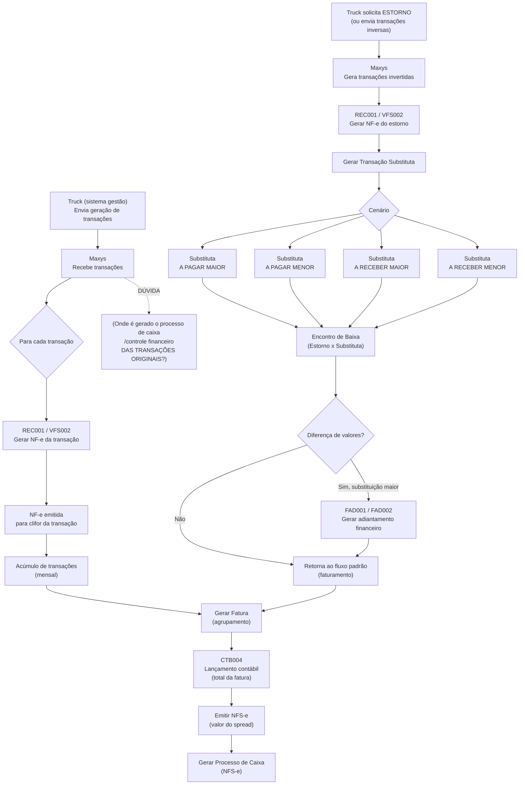
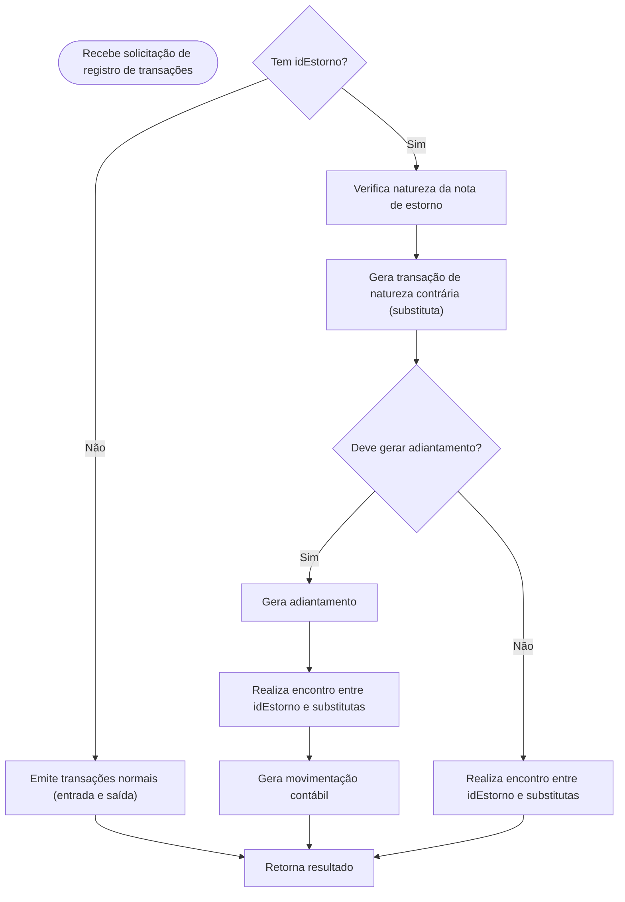

# Fluxo



# Sumário
# Autenticação
  A autenticação é feita via Bearer Token retornado pela rota.

**Método:** GET

**Rota:** https://cloudapp.maxiconsystems.com.br:8474/integracao-api/api/security/login

### Exemplo de Request:

```json
{
    "authorization": "Basic usuárioEsenhaBase64"
}
```

### Exemplo de Response

```json
{
    "token": "token"
}
```

# Geração de Transação



Método responsável por gerar as transações de consumo, ele irá gerar duas notas, uma para registrar o pagamento ao posto de combustível e outra para registrar o recebimento do cliente, retornará dois IDs únicos para cada uma das notas geradas.

**Método:** POST

**Rota:** https://cloudapp.maxiconsystems.com.br:8474/integracao-api/api/INTEGRACAOTVALE/REGISTRA_TRANSACAO

### Relação de Campos → Request:

| Campo | Tipo de dados | Observação |
| --- | --- | --- |
| idEstorno | String | Identificador da transação a ser estornada (quando informado, o processamento ocorre como estorno). |
| dadosNotas | Array | Lista de notas a serem processadas. Cada item do array contém os seguintes campos: |
| nrCpfCnpjBeneficiario | String(14) | CPF/CNPJ do beneficiário da nota (utilizado para geração da nota de entrada). (Obrigatório apenas quando **não** existe idEstorno)|
| cdMunicipioBeneficiario | Number(7) | Código IBGE do município do beneficiário. |
| nrCpfCnpjPagador | String(14) | CPF/CNPJ do pagador da transação (utilizado para geração da nota de saída). (Obrigatório apenas quando **não** existe idEstorno). |
| cdMunicipioPagador | Number(7) | Código IBGE do município do pagador. (Obrigatório apenas quando **não** existe idEstorno). |
| dtEmissaoFornec | Date | Data de emissão da nota do fornecedor. |
| vlRecebido | Number(15,2) | Valor recebido do cliente. (Usado apenas em operações **sem** idEstorno). |
| vlPago | Number(15,2) | Valor pago ao fornecedor/posto. |
| psNotaFiscal | Number(15,2) | Peso da nota fiscal. (Opcional nos novos modelos). |
| nrNfFornec | Number(10) | Número da nota do fornecedor. |

### Exemplo de Request:

```json
{
  "body": [
    {
      "idEstorno":0010000268010010
      "dadosNotas": [
        {
          "nrCpfCnpjBeneficiario": "88389594048",
          "cdMunicipioBeneficiario": 4317202,
          "nrCpfCnpjPagador": "79190055000161",
          "cdMunicipioPagador": 4127700,
          "dtEmissaoFornec": "15/12/2025",
          "vlRecebido": 2000,
          "vlPago": 1800,
          "psNotaFiscal": 1,
          "nrNfFornec": 2512151
        },
        {
          "nrCpfCnpjBeneficiario": "88389594048",
          "cdMunicipioBeneficiario": 4317202,
          "nrCpfCnpjPagador": "79190055000161",
          "cdMunicipioPagador": 4127700,
          "dtEmissaoFornec": "15/12/2025",
          "vlRecebido": 1800,
          "vlPago": 2000,
          "psNotaFiscal": 1,
          "nrNfFornec": 2512152
        }
      ]
    }
  ]
}
```

### Relação de Campos → Response

| Campo | Tipo de dados | Observação |
| --- | --- | --- |
| code | Number(3) | Código do retorno |
| message | String(4000) | Mensagem de retorno |
| transacoes | ArrayList | Lista de transações de retorno |
| nrNfFornec | Number(8) | Número identificador da transação |
| idPagamento | String(20) | Id da nota fiscal gerada referente ao pagamento ao posto conveniado. |
| idRecebimento | String(20) | Id da nota fiscal gerada referente ao recebimento do cliente. |

### Exemplo de Response

```json
{
  "code": 200,
  "message": "Sucesso",
  "transacoes": [
    {
      "nrNfFornec": 1967028,
      "idPagamento": "0010000268010010",
      "idRecebimento": "0010000589260021"
    },
    {
      "nrNfFornec": 1967027,
      "idPagamento": "0010000268020010",
      "idRecebimento": "0010000589270021"
    },
    {
      "nrNfFornec": 1967025,
      "idPagamento": "0010000268030010",
      "idRecebimento": "0010000589280021"
    },
    {
      "nrNfFornec": 1967026,
      "idPagamento": "0010000268040010",
      "idRecebimento": "0010000589290021"
    }
  ]
}

```

### Possíveis códigos de erro

| Código | Descrição |
| --- | --- |
| 200 | Sucesso na transação. |
| 404 | Erro de validação no lançamento. |
| 500 | Erro interno do servidor. Verificar a tag message. |

# Geração de Fatura de Recebimento

Método responsável por agrupar notas de recebimento em uma fatura.

**Método:** POST

**Rota:** https://cloudapp.maxiconsystems.com.br:8474/integracao-api/api/INTEGRACAOTVALE/FATURARECTO

### Relação de Campos → Request:

| Campo | Tipo de dados | Observação |
| --- | --- | --- |
| idsRecebimento | String(20) | Array com os IDs das notas de recebimento que serão incluidas na fatura. |

### Exemplo de Request:

```json
{
    "body": [
        {
            "idsRecebimento": [
                "0084005003740101"
            ]
        }
    ]
}
```

### Relação de Campos → Response

| Campo | Tipo de dados | Observação |
| --- | --- | --- |
| code | Number(3) | Código do retorno |
| message | String(4000) | Mensagem de retorno |
| idFatura | String(20) | Id da fatura de recebimento gerada. |

### Exemplo de Response

```json
{
    "code": 200,
    "message": "Sucesso",
    "idFatura": 14
}
```

# Geração de Fatura de Pagamento

Método responsável por agrupar notas de pagamento em uma fatura.

**Método:** POST

**Rota:** https://cloudapp.maxiconsystems.com.br:8474/integracao-api/api/INTEGRACAOTVALE/FATURAPAGTO

### Relação de Campos → Request:

| Campo | Tipo de dados | Observação |
| --- | --- | --- |
| idsPagamento | String(20) | Array com os IDs das notas de pagamento que serão incluidas na fatura. |

### Exemplo de Request:

```json
{
    "body": [
        {
            "idsPagamento": [
                "00840071382900100"
            ]
        }
    ]
}
```

### Relação de Campos → Response

| Campo | Tipo de dados | Observação |
| --- | --- | --- |
| code | Number(3) | Código do retorno |
| message | String(4000) | Mensagem de retorno |
| idFatura | String(20) | Id da fatura de pagamento gerada. |

### Exemplo de Response

```json
{
    "code": 200,
    "message": "Sucesso",
    "idFatura": 10
}
```

# Geração de Nota Fiscal de Serviço

Método responsavel por gerar a nota fiscal de serviço com o valor de SPREAD dos documentos/faturas.

**Método:** POST

**Rota:** https://cloudapp.maxiconsystems.com.br:8474/integracao-api/api/INTEGRACAOTVALE/GERA_NOTAFISCALSERVICO

### Relação de Campos → Request:

| Campo | Tipo de dados | Observação | Obrigatoriedade |
| --- | --- | --- | --- |
| nrCpfCnpjPagador | String(14) | CPF/CNPJ do pagador da nota. | Obrigatório |
| cdMunicipioPagador | Number(7) | Municipio do pagador da nota. | Obrigatório |
| psNotaFiscal | Number(15,2) | Peso da nota. | Obrigatório |
| transacoes | Array | Array com os IDs das notas(Recebimento ou Pagamento) que serão utilizadas para gerar o valor do spread. | Opcional* |
| idsFaturasPagto | Array | Array com os IDs das faturas de pagamento que serão utilizadas para gerar o valor do spread. | Opcional* |
| idsFaturasRecbto | Array | Array com os IDs das faturas de recebimento que serão utilizadas para gerar o valor do spread. | Opcional* |

*Obs: No request apenas um dos arrays(transacoes, idsFaturasPagto e idsFaturasRecebto) deve ser informado.

### Exemplo de Request:

```json
{
    "body": [
        {
            "idsFaturasPagto":["9"],
            "nrCpfCnpjPagador": "61420325019",
            "cdMunicipioPagador": 4127700,
            "psNotaFiscal": 1
        }
    ]
}
```

### Relação de Campos → Response

| Campo | Tipo de dados | Observação |
| --- | --- | --- |
| code | Number(3) | Código do retorno |
| message | String(4000) | Mensagem de retorno |
| idNotaFiscal | String(20) | Id da nota fiscal de serviço gerada. |

```json
{
    "code": 200,
    "message": "Sucesso",
    "idNotaFiscal": "00840050038900A1"
}
```

# Geração de Processo de Caixa

Método responsável por gerar e executar o processo de caixa dos documentos.

**Método:** POST

**Rota:** https://cloudapp.maxiconsystems.com.br:8474/integracao-api/api/INTEGRACAOTVALE/GERA_PROCESSO

### Relação de Campos → Request:

| Campo | Tipo de dados | Observação |
| --- | --- | --- |
| dtPagamento | Date | Data do pagamento do processo de caixa. |
| nrCpfCnpj | String(20) | CPF/CNPJ do clifor do processo. |
| idsDocumentos | Array | Array com ids dos documentos a serem baixados(Recebimento, Pagamentou ou Nota Fiscal de Serviço) |

### Exemplo de Request:

```json
{
    "body": [
        {
            "dtPagamento": "09/10/2023",
            "nrCpfCnpj": "21078384000135",
            "idsDocumentos": [
                "00840050038200A1"
            ]
        }
    ]
}
```

### Relação de Campos → Response

| Campo | Tipo de dados | Observação |
| --- | --- | --- |
| code | Number(3) | Código do retorno |
| message | String(4000) | Mensagem de retorno |
| idProcesso | String(20) | Id do processo de caixa gerado. |

```json
{
    "code": 200,
    "message": "Sucesso",
    "idProcesso": "008400118287"
}
```

# Geração de Estorno de Transação

Método responsável por estornar notas fiscais, irá gerar uma nova transação para posteriormente seguir com o processo de geração de fatura, nota fiscal de serviço e processo de caixa.

**Método:** POST

**Rota:** https://cloudapp.maxiconsystems.com.br:8474/integracao-api/api/INTEGRACAOTVALE/ESTORNA_NOTA

### Relação de Campos → Request:

| Campo | Tipo de dados | Observação |
| --- | --- | --- |
| nrCpfCnpjBeneficiario | String(14) | CPF/CNPJ do Motorista que gerou a transação de consumo nos postos conveniados que será utilizado para geração da nota de entrada. |
| cdMunicipioBeneficiario | Number(7) | Código do município IBGE da transação de consumo. |
| nrCpfCnpjPagador | String(14) | CPF/CNPJ do pagador de consumo que será utilizado para a geraçao da nota de saída. |
| cdMunicipioPagador | Number(7) | Código do município IBGE do pagador. |
| dtEmissaoFornec | Date | Data da emissão da nota do fornecedor. |
| vlRecebido | Number(15,2) | Valor recebido do cliente. |
| vlPago | Number(15,2) | Valor pago ao posto |
| psNotaFiscal | Number(15,2) | Peso da nota fiscal |
| nrNfFornec | Number(10) | Número da nota do fornecedor |
| idNotaFiscal | String(20) | Id da nota fiscal que será estornada. |

### Exemplo de Request:

```json
{
    "body": [
        {
            "nrCpfCnpjBeneficiario": "61420325019",
            "cdMunicipioBeneficiario": 4127700,
            "nrCpfCnpjPagador": "83596775000107",
            "cdMunicipioPagador": 4210407,
            "dtEmissaoFornec": "07/11/2023",
            "vlRecebido": 2000,
            "vlPago": 1800,
            "psNotaFiscal": 1,
            "nrNfFornec": 77762,
            "idNotaFiscal": "0084007138360010"
        }
    ]
}
```

### Relação de Campos → Response

| Campo | Tipo de dados | Observação |
| --- | --- | --- |
| code | Number(3) | Código do retorno |
| message | String(4000) | Mensagem de retorno |
| idNotaFiscal | String(20) | Id da nota fiscal gerada. |

**Relação de Campos → Response**

```json
{
    "code": 200,
    "message": "Sucesso",
    "idNotaFiscal": "00840050038900A1"
}
```
